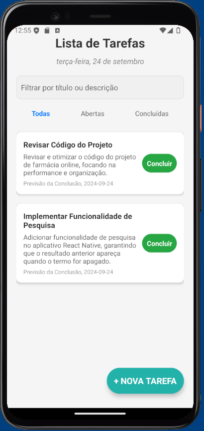
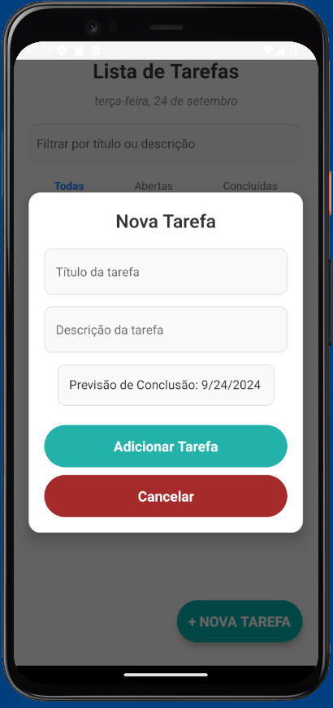
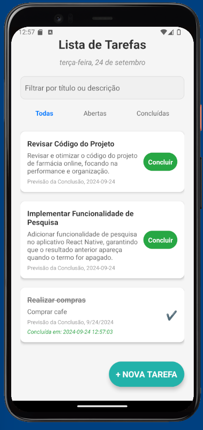

# Task_App

Task_App é uma aplicação de gerenciamento de tarefas desenvolvida em **React Native**. Com este aplicativo, os usuários podem criar, visualizar e gerenciar tarefas, além de marcar tarefas como concluídas e visualizar as tarefas concluídas na ordem das mais recentes.

## Funcionalidades

- **Adicionar Tarefas:** O usuário pode adicionar novas tarefas com título e descrição.
- **Listar Tarefas:** As tarefas são listadas na aba "Todas" e podem ser filtradas por status (Abertas ou Concluídas).
- **Concluir Tarefas:** As tarefas podem ser marcadas como concluídas. Ao concluir uma tarefa, ela é movida para a aba "Concluídas".
- **Ordenar por Conclusão:** As tarefas na aba "Concluídas" são listadas em ordem das mais novas para as mais antigas.
- **Exibir Data de Conclusão:** A data e hora de conclusão são exibidas no card das tarefas concluídas.

## Tecnologias Utilizadas

- **React Native:** Framework utilizado para desenvolver o app.
- **Expo:** Plataforma para construir, compilar e testar a aplicação.
- **AsyncStorage:** Usado para persistir as tarefas no armazenamento local do dispositivo.
- **Date-Fns:** Biblioteca para formatação de datas.
- **JavaScript ES6:** Linguagem de programação utilizada.

## Telas







## Instalação

### Pré-requisitos

Certifique-se de ter o **Node.js** e **npm** (ou **Yarn**) instalados em sua máquina.

### Passo a Passo

1. Clone este repositório:

   ```bash
   git clone https://github.com/alexandrooliveira87/Projeto_Task_APP_React_Native
   
2. Acesse o diretório do projeto:

cd Task_App

3. Instale as dependências:

npm install

4. Inicie o servidor de desenvolvimento do Expo:

npm start

5. Escaneie o QR code no terminal com o aplicativo Expo Go (disponível para iOS e Android) para rodar o aplicativo no seu dispositivo físico, ou execute em um emulador Android/iOS.


